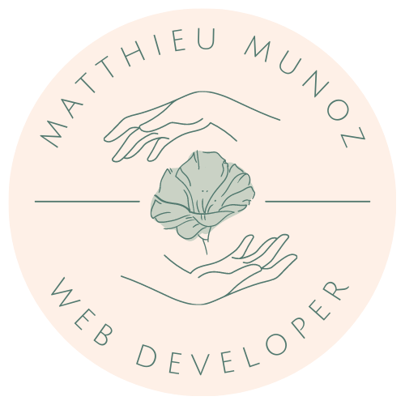
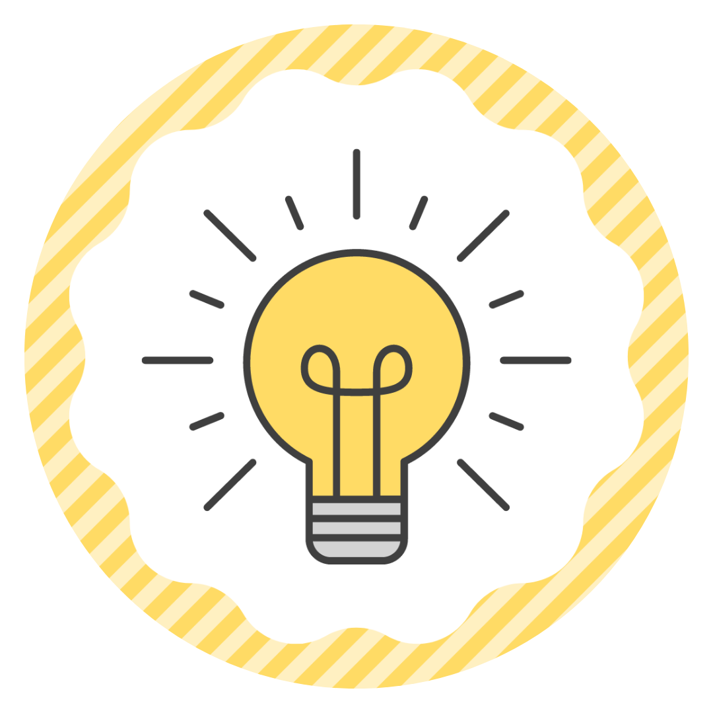

<h1>

&nbsp;Bien le bonjour! Moi c'est Matthieu

</h1>

<table align="right">
 <tr><td><a href="README_fr.md"> Français</a></td></tr>
 <tr><td><a href="README.md"> English</a></td></tr>
</table>

  &nbsp;&nbsp;&nbsp;&nbsp;
  &nbsp;&nbsp;&nbsp;&nbsp;
  &nbsp;&nbsp;&nbsp;&nbsp;
  &nbsp;&nbsp;&nbsp;&nbsp;
  &nbsp;&nbsp;&nbsp;&nbsp;

  

  Je suis un développeur web passionné par la création d'expériences digitales engageantes et intuitives. Fort d'une formation intensive suivie de deux ans d'expérience chez Digitale Deluxe, une agence web Bisontine, j'ai affiné mes compétences en développement front-end et en intégration tout en conservant une polyvalence full-stack en PHP. Je m'épanouis particulièrement dans la collaboration au sein d'une équipe pour donner vie à des visions créatives. Que ce soit à travers des refontes graphiques, de l'intégration de maquettes ou la gestion de projets construits sur Drupal, WordPress ou entièrement sur mesure.
   
   
  Au-delà de mon travail en agence, j'aime mettre mes compétences au service de projets qui me tiennent à cœur. En tant que co-fondateur et webmaster de l'association Aphantasia Club, j'ai conçu et optimisé le site WordPress, démontrant ainsi ma capacité à allier expertise technique et passion pour un impact positif.

<h3 align="center">
  Deux projets recents
</h3>

<h3 align="center">

<a href="assets/resume.pdf">Mon CV</a> | <a href="https://matthieu-munoz.fr">Mon portfolio</a>

</h3>

  :revolving_hearts:
   
  <b>-&nbsp;&nbsp;Ce que je connais et aime&nbsp;&nbsp;-</b>

  
  
  
  
  
  
  
  

  :ok_hand:
   
  <b>-&nbsp;&nbsp;Ce avec quoi je suis à l'aise&nbsp;&nbsp;-</b>

  
  
  
  
  
  
  
  
  

  :muscle:
   
  <b>-&nbsp;&nbsp;Bientôt sur vos écrans&nbsp;&nbsp;-</b>

  
  
  
  

  :gear:
   
  <b>-&nbsp;&nbsp;Statistique GitHub&nbsp;&nbsp;-</b>

 

  

  
  

